# UMKM OpsHub

Dashboard operasional untuk UMKM: produk, kategori, stok masuk/keluar, transaksi, pelanggan, invoice PDF, laporan penjualan, audit log, dan multi-role login.

> Repository ini disiapkan sebagai showcase dan source preview. File runtime seperti `.env`, database lokal, credential, storage production, dependency, build output, log, dan hasil test tidak disertakan, sehingga hasil clone tidak langsung bisa dijalankan tanpa konfigurasi environment sendiri.

## Stack

- Backend: Laravel REST API, Sanctum bearer token, DomPDF
- Frontend: React, TypeScript, Vite, Tailwind CSS, Recharts
- Database: MySQL untuk deployment, SQLite dapat dipakai untuk smoke test lokal
- Deploy: backend ke Railway/Render/VPS, frontend ke Vercel

## Fitur Yang Sudah Dibuat

- Login role `admin`, `staff`, `owner` dengan password hashing Laravel.
- RBAC middleware untuk route admin/owner/staff.
- CRUD kategori, produk, pelanggan, dan user.
- Stok masuk, stok keluar, adjustment, alert stok menipis.
- Input transaksi dengan subtotal, diskon, pajak, pembayaran, dan pengurangan stok otomatis.
- Invoice/nota PDF via endpoint `GET /api/sales/{sale}/invoice`.
- Dashboard analytics: omzet, transaksi, pelanggan aktif, produk stok menipis, grafik harian, produk terlaris.
- Audit log untuk create/update/delete produk, kategori, pelanggan, user, transaksi, dan perubahan stok.
- Modal dan toast custom untuk konfirmasi, notifikasi, dan error aplikasi.
- Pengaturan tema `terang`, `gelap`, atau `sistem`, serta bahasa `Indonesia`, `Inggris`, atau `sistem`.
- Security baseline: rate limit login, validation request, Sanctum token auth, role-based access, hashed password, CORS env, dan soft delete produk.

## Galeri Fitur

### 1. Login multi-role

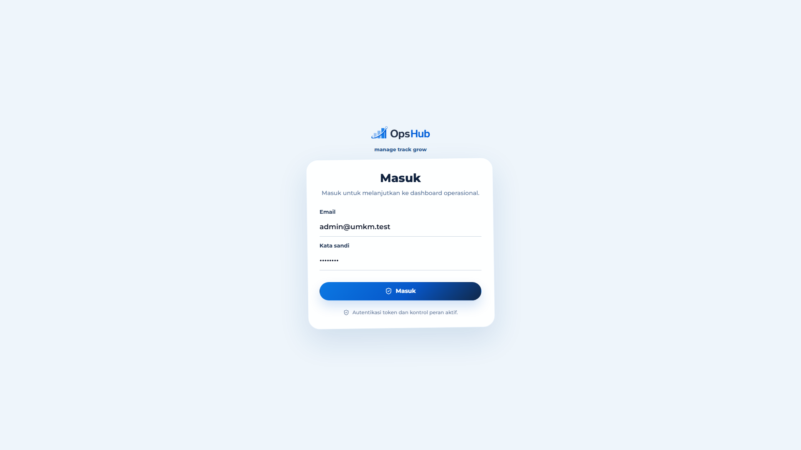

Halaman login menggunakan tampilan corporate yang sederhana dan modern. Aplikasi mendukung akses berbasis role untuk Admin, Kasir/Staff, dan Owner.

### 2. Dashboard operasional

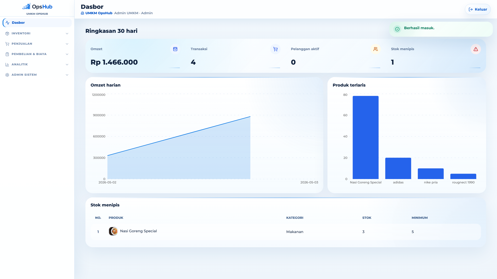

Dashboard menampilkan ringkasan 30 hari seperti omzet, jumlah transaksi, pelanggan aktif, stok menipis, grafik omzet harian, dan produk terlaris.

### 3. Manajemen produk

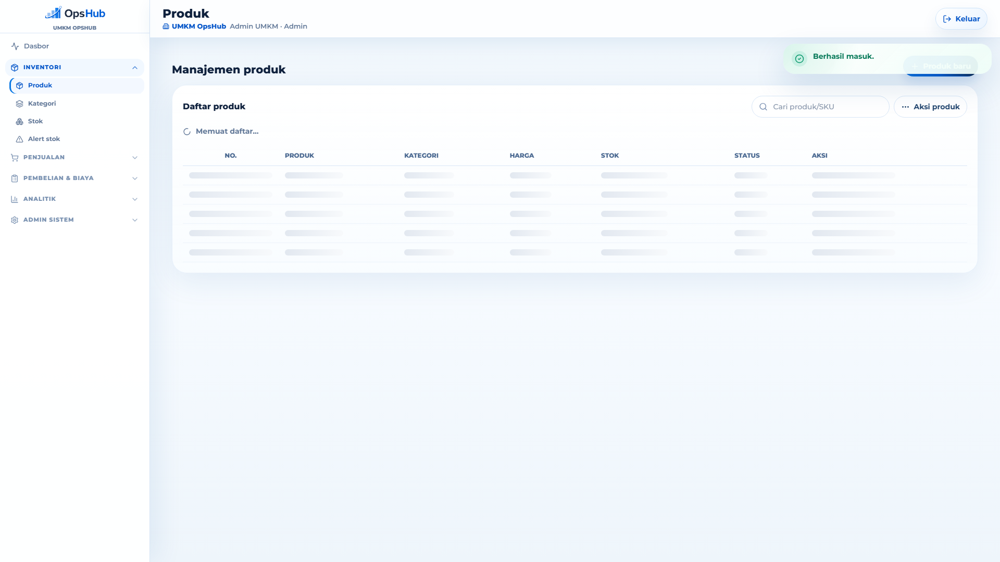

Produk dapat dikelola lengkap dengan SKU, kategori, harga, stok, status aktif, foto produk, pencarian, pagination, import, dan export data.

### 4. Manajemen kategori

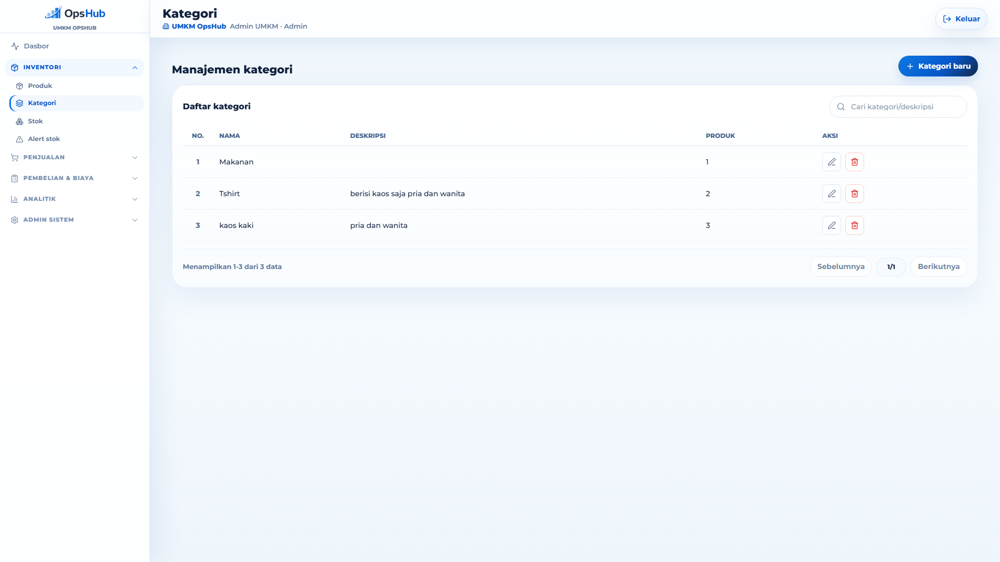

Kategori membantu mengelompokkan produk agar pencarian, laporan, dan pengelolaan stok lebih rapi.

### 5. Riwayat stok

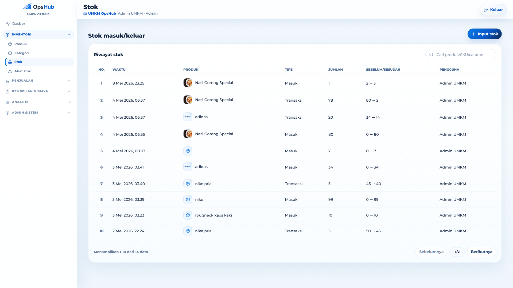

Setiap stok masuk, stok keluar, adjustment, dan transaksi tercatat dengan informasi jumlah sebelum/sesudah serta pengguna yang melakukan perubahan.

### 6. Alert stok

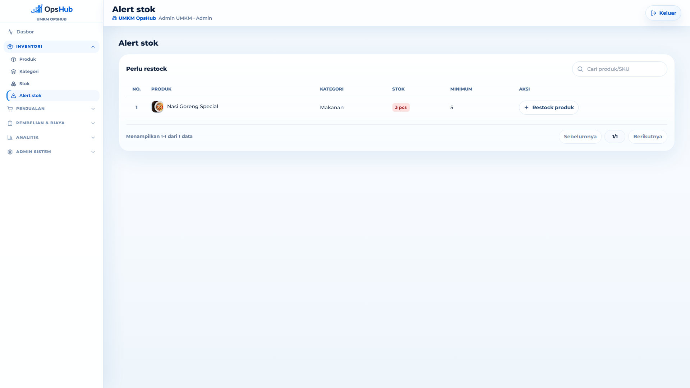

Produk yang berada di bawah batas minimum otomatis muncul di halaman alert stok dan bisa langsung direstock dari halaman tersebut.

### 7. Transaksi penjualan

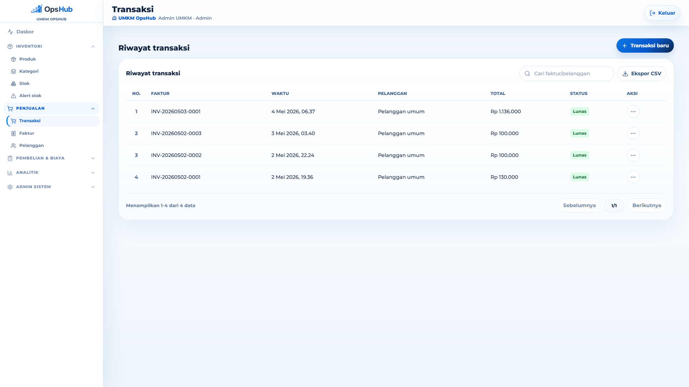

Halaman transaksi mencatat penjualan, status pembayaran, total transaksi, serta aksi lanjutan seperti export, cetak faktur, pembatalan, dan refund.

### 8. Faktur penjualan

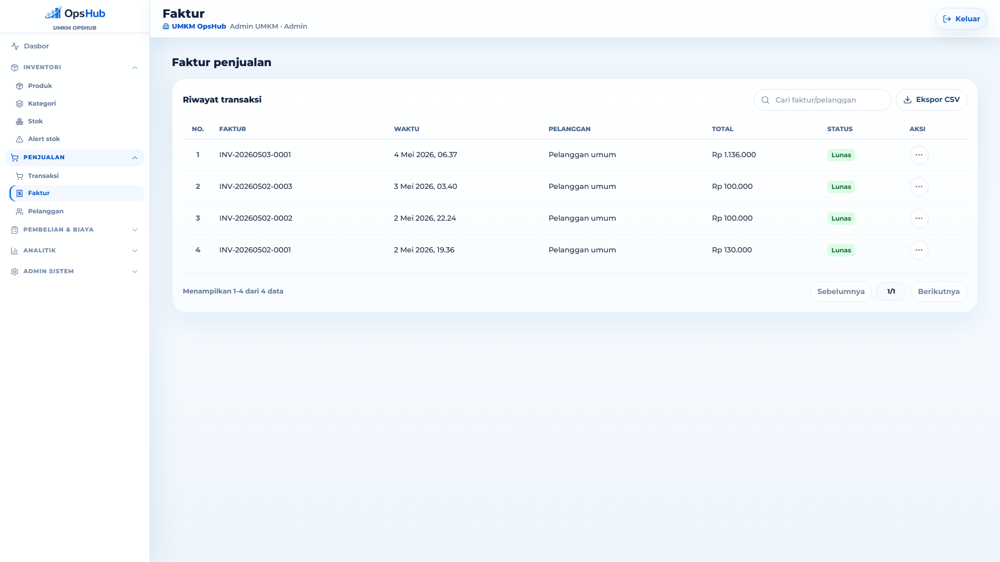

Faktur menampilkan riwayat transaksi yang siap diunduh sebagai PDF nota/invoice dengan format yang disesuaikan dengan branding toko.

### 9. Manajemen pelanggan

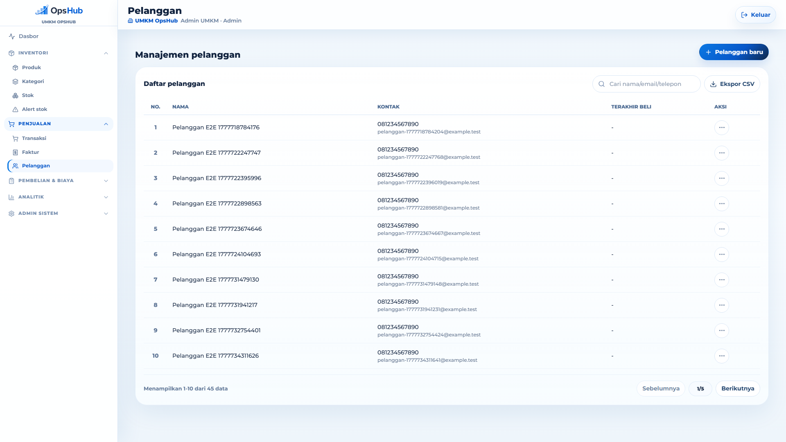

Data pelanggan menyimpan nama, kontak, email, terakhir beli, pencarian cepat, export CSV, dan detail riwayat pembelian pelanggan.

### 10. Pembelian stok

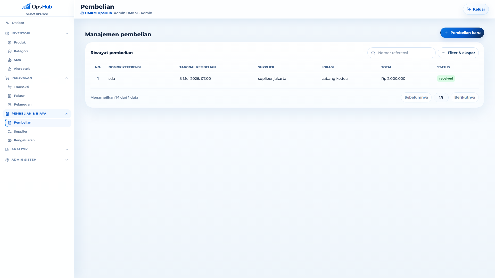

Fitur pembelian mencatat stok masuk dari supplier, nomor referensi, lokasi, status pembelian, dan total biaya pembelian.

### 11. Supplier

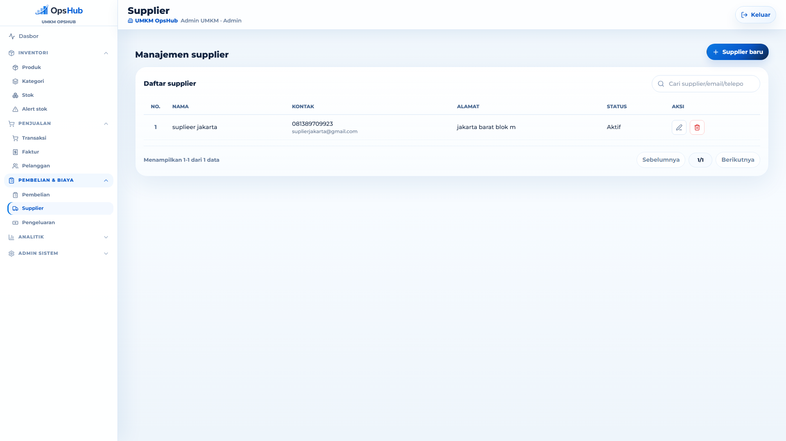

Supplier dapat dikelola dengan data kontak, email, alamat, dan status aktif untuk mendukung pencatatan pembelian barang.

### 12. Pengeluaran operasional

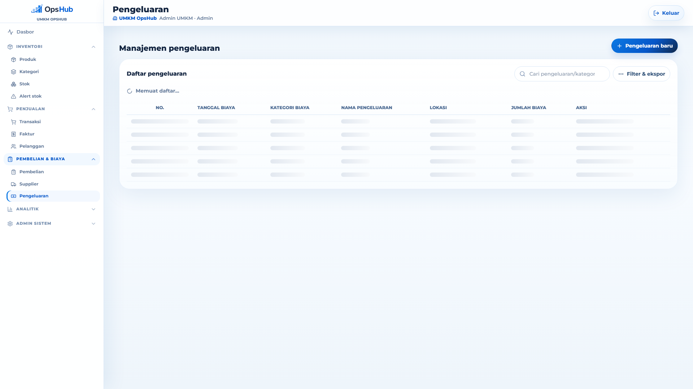

Pengeluaran seperti bahan, sewa, gaji, listrik, dan biaya operasional lain dicatat agar laporan laba rugi lebih akurat.

### 13. Laporan penjualan

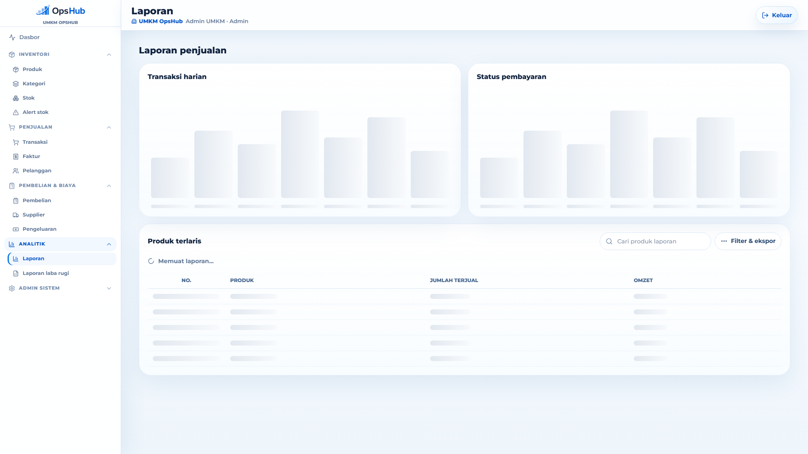

Laporan menyediakan grafik transaksi harian, status pembayaran, produk terlaris, pencarian, filter tanggal, serta export CSV/PDF.

### 14. Laporan laba rugi

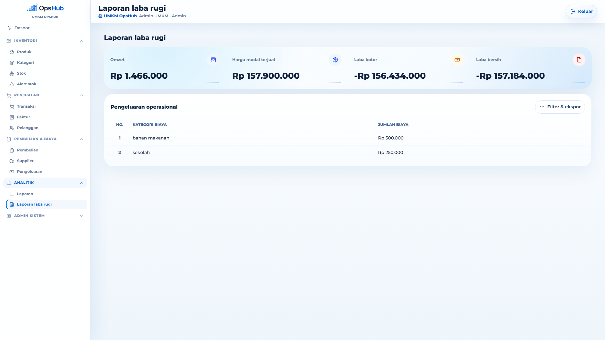

Laporan laba rugi menghitung omzet, harga modal terjual, laba kotor, pengeluaran operasional, dan estimasi laba bersih.

### 15. Lokasi cabang dan gudang

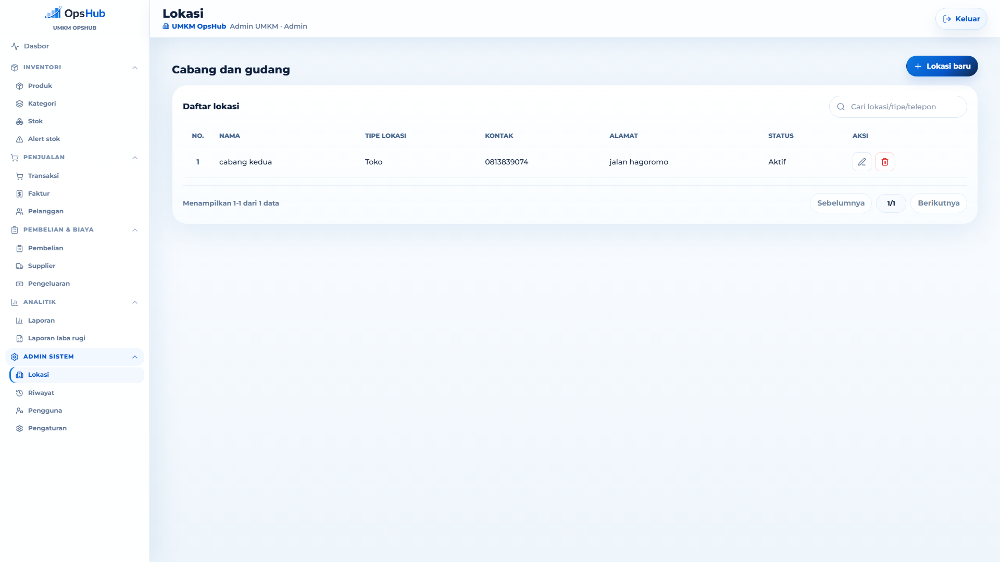

Lokasi digunakan untuk mencatat cabang toko atau gudang sehingga pembelian, stok, dan laporan dapat dikaitkan dengan tempat operasional.

### 16. Riwayat aktivitas

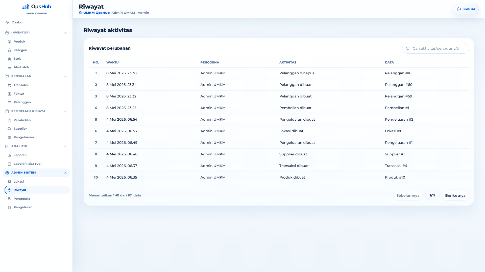

Audit log mencatat aktivitas penting seperti produk dibuat, stok berubah, transaksi dibuat, pelanggan dihapus, dan pengguna yang melakukan perubahan.

### 17. Manajemen pengguna

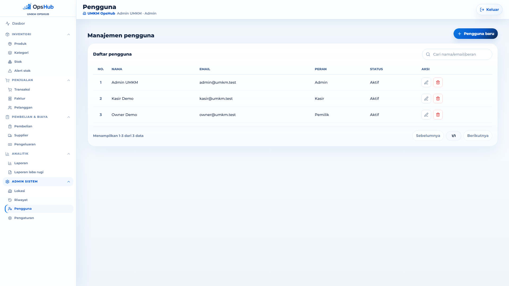

Admin dapat mengelola pengguna aplikasi, role, status aktif, serta akses dasar untuk operasional toko.

### 18. Pengaturan aplikasi

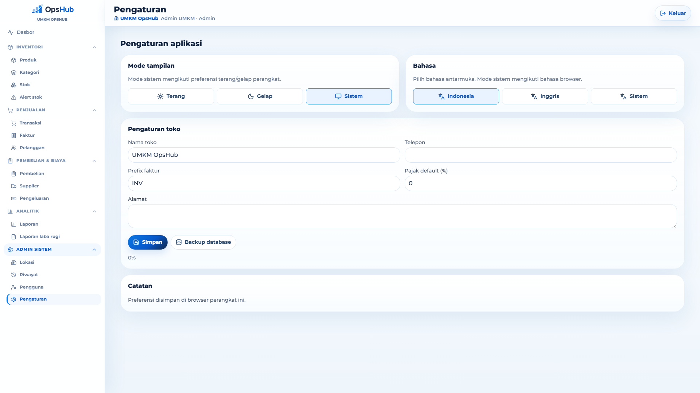

Pengaturan mendukung tema terang/gelap/sistem, bahasa Indonesia/Inggris/sistem, data toko, prefix faktur, pajak default, dan backup database.

## Status Publik

Repository public tetap dapat di-clone oleh siapa pun. Perlindungan yang diterapkan adalah tidak menyertakan file rahasia dan data runtime. Untuk mencegah penggunaan ulang secara legal, repository ini tidak memakai lisensi open-source; hak cipta tetap milik pemilik repository.

## Menjalankan Lokal

### Backend

```bash
cd backend
composer install
cp .env.example .env
php artisan key:generate
```

Untuk MySQL lokal:

```bash
docker compose up -d mysql
```

Lalu sesuaikan `backend/.env`:

```env
DB_CONNECTION=mysql
DB_HOST=127.0.0.1
DB_PORT=3306
DB_DATABASE=umkm_opshub
DB_USERNAME=root
DB_PASSWORD=root
```

Migrasi dan seed:

```bash
php artisan migrate:fresh --seed
php artisan serve
```

Akun seed:

- `admin@umkm.test` / `password`
- `kasir@umkm.test` / `password`
- `owner@umkm.test` / `password`

### Frontend

```bash
cd frontend
npm install
cp .env.example .env
npm run dev
```

Frontend default membaca API dari `VITE_API_BASE_URL=http://localhost:8000/api`.

## Endpoint Utama

- `POST /api/login`
- `GET /api/dashboard`
- `apiResource /api/products`
- `apiResource /api/categories`
- `apiResource /api/customers`
- `apiResource /api/stock-movements`
- `apiResource /api/sales`
- `GET /api/sales/{sale}/invoice`
- `GET /api/audit-logs`
- `apiResource /api/users`

## Checklist Security Dasar

- Wajib pakai HTTPS di production.
- Set `APP_DEBUG=false` dan `APP_ENV=production`.
- Batasi `FRONTEND_URLS` hanya domain frontend production.
- Gunakan secret DB dan `APP_KEY` dari environment platform.
- Jalankan `composer audit` dan `npm audit` di CI.
- Tambahkan backup database dan log retention.
- Tambahkan policy lebih granular bila staff tidak boleh menghapus data.

## Verifikasi

```bash
cd backend && php artisan test
cd frontend && npm run build
cd frontend && npm run e2e
```
